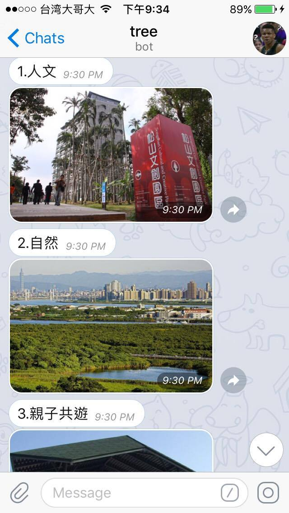
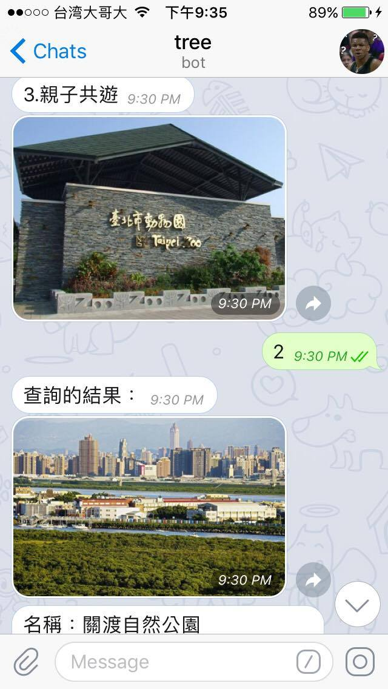
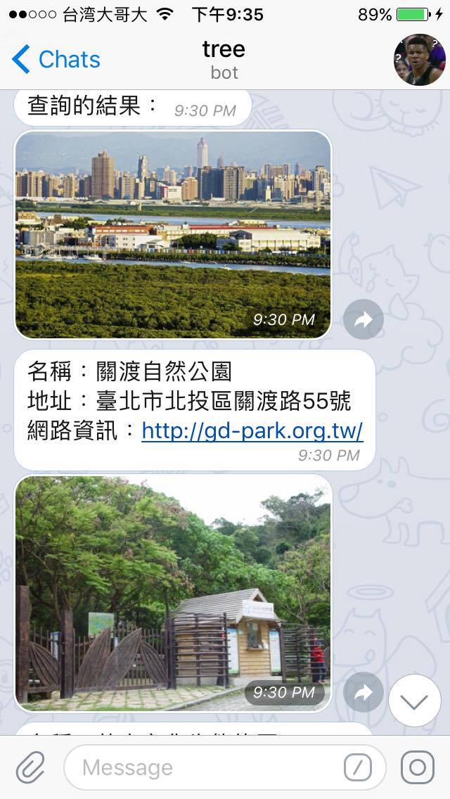
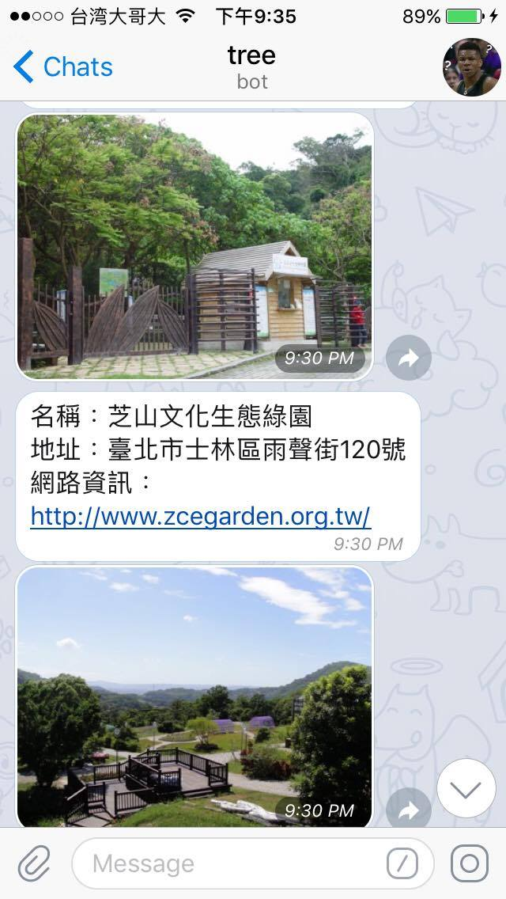
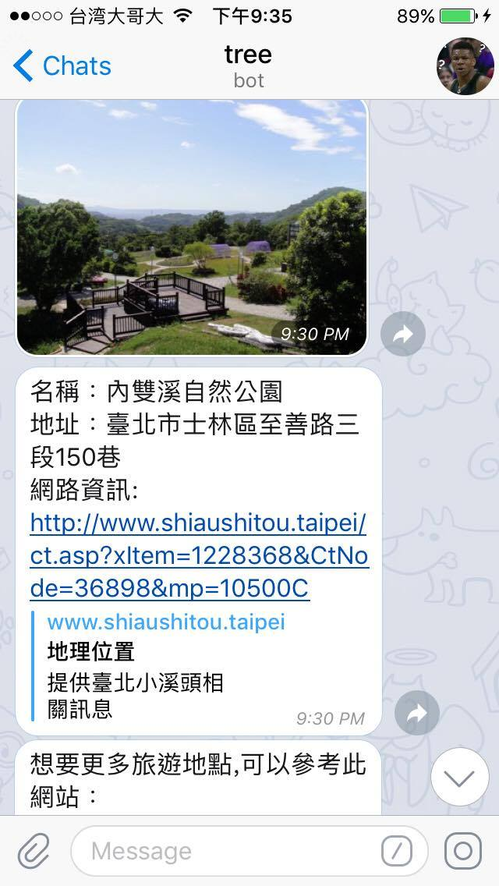
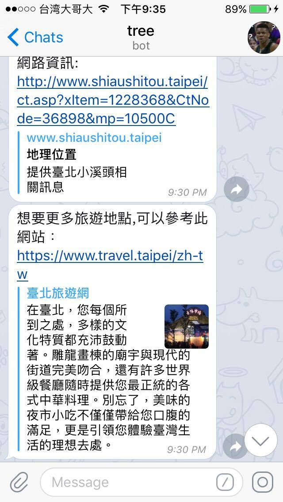

==Toc-Project-2017==
## Run the sever

```shell
python3 app.py
```

## Finite State Machine


## Usage
初始狀態是 `user` 而每一次狀態都會使用 `advance` 來使狀態移動，之後到特定某些狀態代表查詢以結束就會回到最初的 `user`

* user 
    - Input:"go to state0"
    - Input:"go to state1"
    - 從 state0 ~ state 117
    - Input:"go to state117"
---
**主要分成4部份**
1. **<font color="red">第一部份</font>**
    user state0 state1 
    一開始會再user狀態，使用者輸入 **hi** 之後會到state0，這時bot會回答"想不想要知道我私房的景點"，當使用者再輸入 **想** 則會到state1


2. **<font color="red">第二部份</font>**
    state2~state5
    接著bot會詢問使用者"要北部、中部、南部還是東部？" 使用者就可以輸入**北部**或 **中部**或**南部**或**東部**


3. **<font color="red">第三部份</font>**
    state6~state24
    之後bot會詢問 "哪個縣市呢？"
    使用者就依照剛剛選擇是北部、中部、南部還是東部來進行輸入縣市的動作，以下是分類
    北部：**台北市、新北市、基隆市、桃園縣、新竹縣、新竹市、宜蘭縣**
    中部：**苗栗縣、台中市、彰化縣、雲林縣、南投縣**
    南部：**嘉義縣、嘉義市、台南市、高雄市、屏東縣**
    東部：**花蓮縣、台東縣**
4. **<font color="red">第四部份</font>**
    state25~state117
    bot會問使用者"想要我推薦請輸入：1 繼續查詢請輸入：2"
    假使使用者輸入：**1**，則bot會推薦兩個網址，並且上傳影片到聊天室，使用者可點選之後可觀看，假使使用者進到這些狀態就代表查詢動作已經結束了，所以會回到 `user`　
    假使輸入：**2**，則bot會列出3格選項讓使用者選擇
    **1.人文**
    **2.自然**
    **3.親子共遊**
    並且3個選項都有相對的圖可以供使用者觀看，使用者只要輸入**1**、**2**、**3**就可以
    而最後bot也會列出查詢結果的名稱、地址、及網站還有推薦網址，假使使用者進到這些狀態就代表查詢動作已經結束了，所以會回到 `user`　






